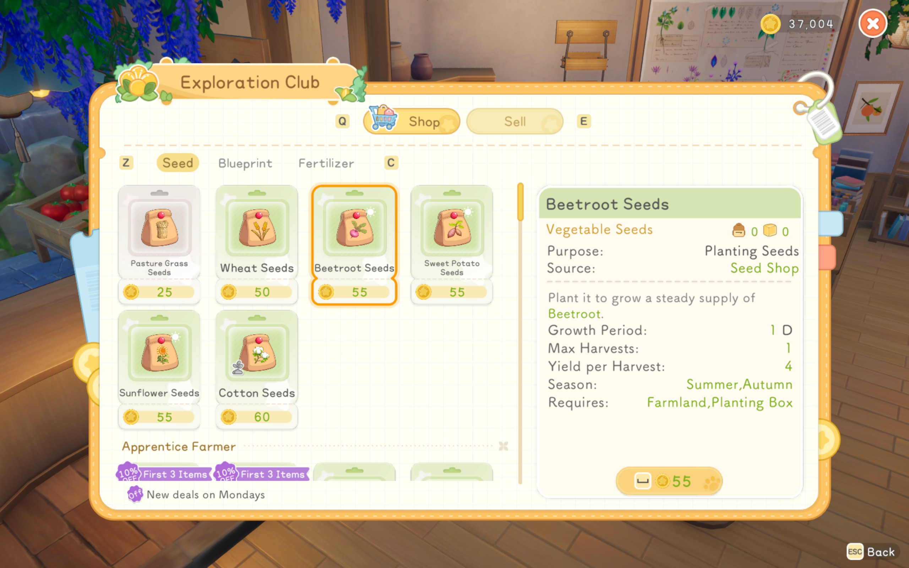

# Starsand Seed Season Indicator

A [BepInEx](https://github.com/BepInEx/BepInEx) mod for **Starsand Island** that shows a small icon over seeds in your inventory when their crop can grow in the current in-game season.



## What it does

- Shows an icon on a seed item when its crop is **seasonal** and **can be planted in the current season**.
- Shows **no icon** for year-round crops.
- Shows **no icon** for crops that are out of season.
- Reads season data from the game's own crop metadata, so there is no hardcoded crop list. Modded or future crops should work automatically.

## Requirements

- Starsand Island (Steam)
- BepInEx installed in the game folder

## Installation

1. Install BepInEx into your Starsand Island folder and run the game once so it generates its folders.
2. Download the latest release from the [Releases](../../releases) page.
3. Copy `StarsandIsland.SeedSeasonDiagnostic.dll` into:
   ```
   <Steam>\steamapps\common\StarsandIsland\BepInEx\plugins\
   ```
4. Launch the game. The icon should appear on eligible seeds in your inventory.

## Building from source

1. Clone the repo:
   ```
   git clone https://github.com/bikinavisho/starsand-seed-season-indicator.git
   ```
2. Open the solution in Visual Studio or VS Code.
3. Make sure the project references the assemblies in your game's `BepInEx\interop` folder (adjust the reference paths if your Steam library is elsewhere).
4. Build, then copy the output DLL into `BepInEx\plugins`.

> The `reference/decompiled_game` folder (if present locally) is git-ignored. It's only used for research and isn't part of the mod.

## How it works

The mod looks at each seed item, resolves it to its crop template, and checks that crop's season list against the current in-game season. If the crop is seasonal and the current season is in its list, an icon is added to the seed's inventory slot.

## Project status

The mod is functional. Seeds in your inventory show a season emoji (🌸 spring, ☀️ summer, 🍂 fall, ❄️ winter) when their crop is seasonal and can be planted in the current season.

The indicator currently uses Unicode emoji rather than a custom image icon. Replacing it with a proper sprite is a possible future improvement.

## Known issues / limitations

- None at the moment; it works for the players inventory, storage, and the seed shop. 

## Contributing

Issues and pull requests are welcome. If you find a seed that shows the wrong state, please include the item name and the in-game season when you report it.

## License

This project is licensed under the [MIT License](LICENSE).

## Disclaimer

This is an unofficial fan-made mod and is not affiliated with the developers or publishers of Starsand Island.