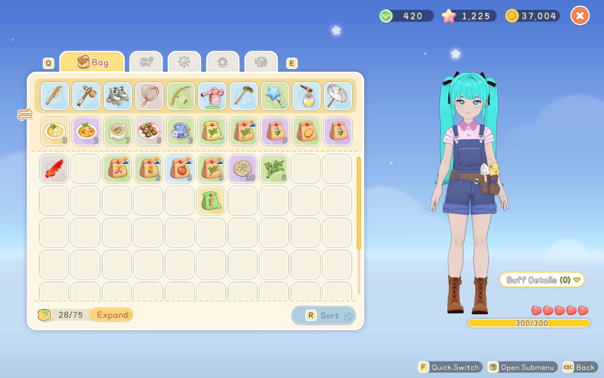
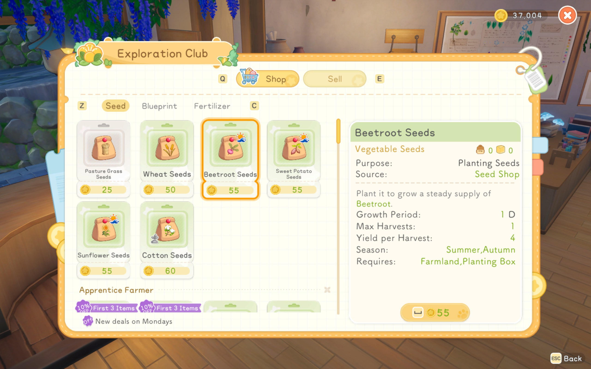

# Starsand Seed Season Indicator

A [BepInEx](https://github.com/BepInEx/BepInEx) mod for **Starsand Island** that shows a small icon over seeds in your inventory when their crop can grow in the current in-game season.



## What it does

- Shows an icon on a seed item when its crop is **seasonal** and **can be planted in the current season**.
- Shows **no icon** for year-round crops.
- Shows **no icon** for crops that are out of season.
- Reads season data from the game's own crop metadata, so there is no hardcoded crop list. Modded or future crops should work automatically.



## Requirements

- Starsand Island (Steam)
- [BepInEx for Starsand Island](https://www.nexusmods.com/starsandisland/mods/9) installed in the game folder

## Installation

1. Install BepInEx into your Starsand Island folder and run the game once so it generates its folders.
2. Download the latest release from the [Releases](../../releases) page.
3. Copy `StarsandIsland.SeedSeasonDisplay.dll` into:
   ```
   <Steam>\steamapps\common\StarsandIsland\BepInEx\plugins\
   ```
4. Launch the game. The icon should appear on eligible seeds in your inventory.

## Building from source

1. Clone the repo:
   ```
   git clone https://github.com/bikinavisho/starsand-seed-season-indicator.git
   ```
2. Open the solution in Visual Studio or VS Code.
3. Make sure the project references the assemblies in your game's `BepInEx\interop` folder (adjust the reference paths if your Steam library is elsewhere).
4. Build, then copy the output DLL into `BepInEx\plugins`.

> The `reference/decompiled_game` folder (if present locally) is git-ignored. It's only used for research and isn't part of the mod.

## How it works

The mod resolves a seed item through the game's `FarmSeedItemExt` metadata to
its crop template, then checks `SeasonConfigs` against the current in-game
season. It displays the matching seasonal PNG only when the crop is seasonal
and growable now; all-season, out-of-season, and non-seed items show no icon.
The PNGs are embedded in the mod DLL, so they do not need to be installed as
separate files.

Visible inventory, storage, and seed-shop indicators are refreshed when the
season changes and periodically so recycled cells reflect their current item.
The plugin does not include the development F7 diagnostic hotkey.

## Project status

The mod is functional. Seeds in your inventory show a custom season icon when their crop is seasonal and can be planted in the current season.

## Known issues / limitations

- None at the moment; it works for the player's inventory, storage, and the seed shop. 

## Contributing

Issues and pull requests are welcome. If you find a seed that shows the wrong state, please include the item name and the in-game season when you report it.

## License

This project is licensed under the [MIT License](LICENSE).

## Disclaimer

This is an unofficial fan-made mod and is not affiliated with the developers or publishers of Starsand Island.